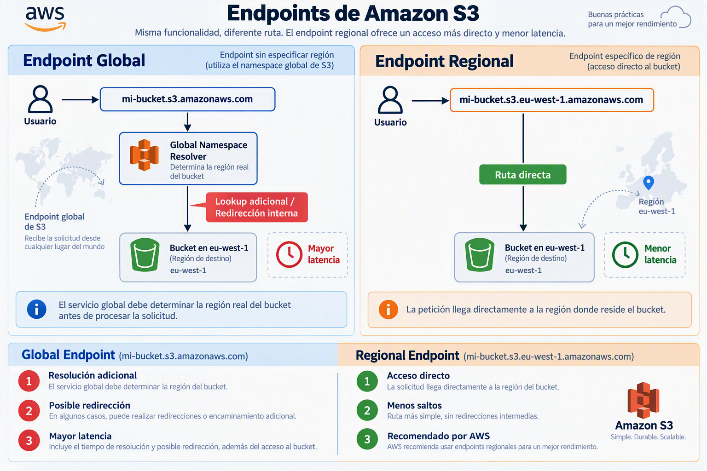

# Configuración Inicial de un Bucket Amazon S3: Fundamentos y Buenas Prácticas

## Introducción

Amazon Simple Storage Service (Amazon S3) es un servicio de almacenamiento de objetos diseñado para proporcionar escalabilidad, disponibilidad, seguridad y rendimiento. Durante la creación de un bucket, AWS solicita diversas configuraciones que influyen directamente en aspectos como la latencia, la seguridad, el control de acceso y la protección de los datos.

Comprender estas opciones resulta esencial para desplegar infraestructuras seguras y alineadas con las recomendaciones actuales de AWS.

---

## 1. Tipo de Bucket

### Bucket de Propósito General (General Purpose Bucket)

Los buckets de propósito general constituyen la opción estándar de Amazon S3 y son adecuados para la mayoría de los casos de uso empresariales.

#### Casos de uso habituales

- Almacenamiento de archivos corporativos.
- Copias de seguridad.
- Data lakes.
- Aplicaciones web.
- Distribución de contenido estático.
- Almacenamiento de registros (logs).

#### Ventajas

- Compatibilidad completa con las funcionalidades de S3.
- Integración con servicios como AWS Lambda, AWS Glue, Amazon Athena y Amazon CloudFront.
- Replicación automática entre múltiples Availability Zones dentro de una región.
- Alta durabilidad y disponibilidad.

#### Recomendación

AWS recomienda utilizar este tipo de bucket en la mayoría de escenarios debido a su elevada compatibilidad y madurez tecnológica.

---

### Directory Bucket (S3 Express One Zone)

Los Directory Buckets forman parte de la tecnología S3 Express One Zone y están diseñados para cargas de trabajo que requieren latencias extremadamente bajas.

#### Casos de uso

- Entrenamiento de modelos de Inteligencia Artificial.
- Procesamiento masivo de datos.
- Computación de alto rendimiento (HPC).
- Aplicaciones sensibles a la latencia.

#### Ventajas

- Menor latencia de acceso.
- Mayor rendimiento por operación.
- Optimización para cargas intensivas de lectura y escritura.

#### Limitaciones

- Disponibilidad restringida a una única Availability Zone.
- Compatibilidad reducida con algunas características tradicionales de S3.
- Mayor complejidad de administración.

#### Recomendación

Solo debe seleccionarse cuando existan requisitos específicos de rendimiento que justifiquen su utilización.

---

## 2. Espacio de Nombres: Global frente a Regional

Durante la creación de un bucket de propósito general, AWS permite seleccionar el comportamiento asociado al espacio de nombres.

### Espacio de Nombres Global

Históricamente, Amazon S3 utilizaba un sistema de resolución global.

#### Funcionamiento

Cuando un cliente realiza una solicitud al endpoint global:

```text
mi-bucket.s3.amazonaws.com
```

AWS debe determinar internamente la región donde se encuentra almacenado el bucket antes de procesar la petición.

#### Implicaciones

- Se introduce una resolución adicional.
- Puede existir una redirección interna.
- Incrementa ligeramente la latencia de acceso.

---

### Espacio de Nombres Regional

En este modelo, el endpoint incluye explícitamente la región donde reside el bucket.

#### Ejemplo

```text
mi-bucket.s3.eu-west-1.amazonaws.com
```

#### Funcionamiento

La solicitud llega directamente a la región correspondiente sin necesidad de realizar comprobaciones adicionales.

#### Ventajas

- Menor latencia.
- Menos saltos de red.
- Menor probabilidad de redirección.
- Mejor alineación con arquitecturas modernas.

### Comparativa



#### Recomendación

AWS recomienda utilizar el espacio de nombres regional para nuevas implementaciones debido a sus beneficios operativos y de rendimiento.

---

## 3. Propiedad de Objetos y ACL

### Concepto de ACL

Las Access Control Lists (ACL) constituyen un mecanismo tradicional para gestionar permisos sobre objetos y buckets.

Permiten definir permisos de lectura y escritura directamente sobre los recursos almacenados.

---

### ACL Habilitadas

Cuando las ACL están activadas:

- Los objetos pueden tener propietarios distintos.
- Los permisos pueden administrarse mediante ACL además de IAM.
- Se incrementa la complejidad administrativa.

#### Riesgos

- Configuraciones inconsistentes.
- Mayor dificultad de auditoría.
- Posibles exposiciones involuntarias.

---

### ACL Deshabilitadas

Cuando las ACL se deshabilitan:

- El bucket se convierte en propietario de todos los objetos almacenados.
- Los permisos se gestionan exclusivamente mediante políticas IAM y políticas de bucket.

#### Ventajas

- Administración más sencilla.
- Modelo de seguridad unificado.
- Menor probabilidad de errores de configuración.

#### Recomendación

AWS recomienda mantener las ACL deshabilitadas en la mayoría de los entornos modernos.

---

## 4. Bloqueo de Acceso Público

### Objetivo

El bloqueo de acceso público evita que usuarios o aplicaciones expongan datos accidentalmente a Internet.

Constituye una de las medidas de seguridad más importantes disponibles en Amazon S3.

---

### Configuración Recomendada

La configuración predeterminada consiste en habilitar las cuatro opciones de protección:

- Bloquear ACL públicas nuevas.
- Bloquear ACL públicas existentes.
- Bloquear políticas públicas del bucket.
- Restringir el acceso público a buckets y objetos.

---

### Beneficios

- Prevención de fugas de información.
- Protección frente a errores humanos.
- Cumplimiento de buenas prácticas de seguridad.

---

### Excepciones

Puede ser necesario desactivar parcialmente estas restricciones cuando:

- Se aloja una página web estática.
- Se distribuyen recursos públicos.
- Se publican ficheros accesibles desde Internet.

En estos casos, la exposición pública debe realizarse de forma controlada y documentada.

---

## 5. Cifrado Predeterminado

### Importancia del Cifrado

El cifrado protege la confidencialidad de los datos almacenados y ayuda a cumplir requisitos normativos y de gobierno corporativo.

Amazon S3 permite cifrar automáticamente todos los objetos almacenados en un bucket.

---

### SSE-S3

Server-Side Encryption with Amazon S3 Managed Keys.

#### Características

- Gestión automática de claves por parte de AWS.
- Sin necesidad de configuración adicional.
- Sin costes extra asociados a la gestión de claves.

#### Casos de uso

- Aplicaciones empresariales estándar.
- Almacenamiento general.
- Copias de seguridad.

---

### SSE-KMS

Server-Side Encryption with AWS Key Management Service.

#### Características

- Utilización de claves gestionadas mediante AWS KMS.
- Control detallado sobre permisos y rotación.
- Integración con auditoría y registros de acceso.

#### Casos de uso

- Entornos regulados.
- Organizaciones con requisitos de cumplimiento.
- Necesidad de control granular sobre las claves criptográficas.

#### Consideraciones

- Puede generar costes adicionales.
- Requiere una gestión más avanzada.

---

## Buenas Prácticas Recomendadas por AWS

Para la mayoría de despliegues empresariales, la configuración recomendada es:

| Configuración             | Valor recomendado                 |
| ------------------------- | --------------------------------- |
| Tipo de bucket            | General Purpose Bucket            |
| Espacio de nombres        | Regional                          |
| ACL                       | Deshabilitadas                    |
| Bloqueo de acceso público | Habilitado                        |
| Cifrado predeterminado    | SSE-S3 o SSE-KMS según requisitos |

---

## Conclusiones

La configuración inicial de un bucket Amazon S3 tiene un impacto directo sobre la seguridad, el rendimiento y la gobernanza de los datos. Para la mayoría de organizaciones, una arquitectura alineada con las recomendaciones actuales de AWS consiste en utilizar un bucket de propósito general, espacio de nombres regional, ACL deshabilitadas, bloqueo de acceso público activo y cifrado habilitado por defecto.

Esta combinación proporciona un equilibrio óptimo entre simplicidad operativa
